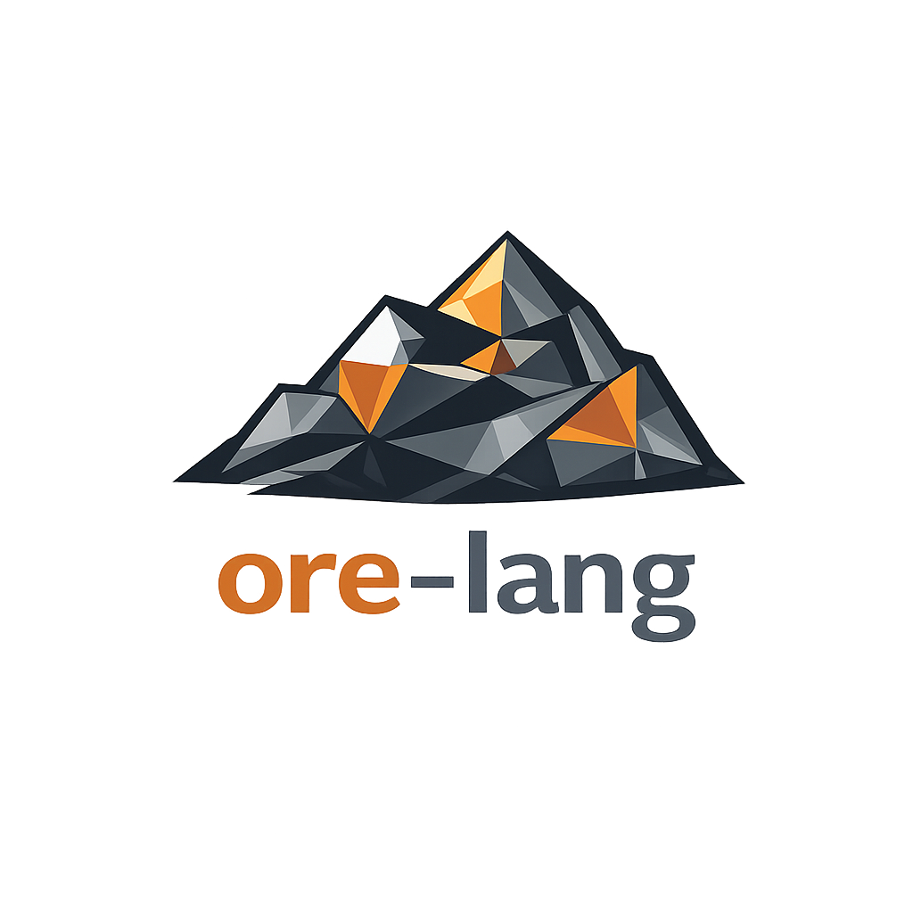

<p align="center">
  
</p>

# Ore

A statically typed, expression-oriented programming language that compiles to native code via LLVM. Ore prioritizes **strong types, batteries-included tooling, and minimal ceremony** — designed so that every token carries meaning.

## Quick Start

```
-- hello.ore
fn main
  print "Hello, world!"
```

```sh
cargo build
./target/debug/ore run hello.ore
```

## What It Looks Like

```
type Point { x:Float, y:Float }

fn distSq a:Point b:Point -> Float
  dx := a.x - b.x
  dy := a.y - b.y
  dx * dx + dy * dy

type Shape
  Circle(radius: Float)
  Rect(width: Float, height: Float)

fn area s:Shape -> Float
  s :
    Circle r -> 3.14159 * r * r
    Rect w h -> w * h

fn main
  p := Point(x: 3.0, y: 4.0)
  print distSq(p, Point(x: 0.0, y: 0.0))
  print area(Circle(radius: 5.0))
```

## Language Features

- **Indentation-based blocks** — no braces, no semicolons
- **Immutable by default** — `x := 1` is immutable, `mut x := 1` is mutable
- **Expression-oriented** — `if`, `match`, and blocks all return values
- **Sum types and pattern matching** — exhaustive, with `match`-via-`:` syntax
- **Record types** — with named fields and construction syntax
- **Generics** — parameterized types like `List[T]`
- **Traits and impl blocks** — `trait Display { ... }`, `impl Display for Point { ... }`
- **Built-in Option and Result** — `T?` sugar, `?` error propagation
- **Closures** — with variable capture
- **String interpolation** — `"Hello, {name}!"`
- **Pipeline operator** — `data |> transform |> output`
- **Concurrency** — `spawn`, `sleep`, thread joining
- **Multi-file modules** — `use` imports

## Tooling

```sh
ore run file.ore       # compile and run (JIT)
ore build file.ore     # compile to native binary
ore check file.ore     # parse and type-check
ore fmt file.ore       # auto-format source
ore repl               # interactive REPL
```

## Building from Source

Requires Rust and LLVM 19.1.

```sh
git clone <repo-url>
cd ore
cargo build
```

The `ore` binary is at `target/debug/ore`. For AOT compilation (`ore build`), the workspace must be built so `libore_runtime.a` is available alongside the binary.

## Project Structure

```
src/              # The Ore compiler, written in Ore (self-hosted)
bootstrap/        # Bootstrap compiler (Rust), used to build src/
  ore_cli/        # CLI frontend (run, build, check, fmt, repl)
  ore_lexer/      # Tokenizer
  ore_parser/     # Parser and AST, formatter
  ore_types/      # Type definitions
  ore_typecheck/  # Type checker
  ore_codegen/    # LLVM IR generation (via inkwell)
  ore_c_codegen/  # C code generation (no LLVM dependency)
  ore_runtime/    # Runtime library (print, strings, lists, concurrency)
docs/             # Language design documents
tests/            # Test fixtures (.ore files)
```

## Design Documents

- [PHILOSOPHY.md](docs/PHILOSOPHY.md) — why Ore exists
- [SYNTAX.md](docs/SYNTAX.md) — syntax design and rationale
- [FEATURES.md](docs/FEATURES.md) — planned core features
- [EXAMPLES.md](docs/EXAMPLES.md) — full program examples
- [TOOLING.md](docs/TOOLING.md) — CLI and developer tooling
- [CONCURRENCY.md](docs/CONCURRENCY.md) — concurrency model
- [COMPETITIVE.md](docs/COMPETITIVE.md) — comparison with other languages
- [TRADEOFFS.md](docs/TRADEOFFS.md) — design tradeoffs
- [RADICAL.md](docs/RADICAL.md) — radical syntax exploration

## Status

The Ore compiler is self-hosting: `src/` contains the compiler written in Ore itself, which the Rust bootstrap compiler (`bootstrap/`) can build via the C backend. The bootstrap compiler implements: lexing, parsing, LLVM codegen (JIT and AOT), C codegen, record types, sum types with pattern matching, generics, traits, closures, Option/Result types, mutability checking, multi-file modules, concurrency primitives, lists with map/filter/each, and an interactive REPL.

## License

Apache-2.0 -- see [LICENSE](LICENSE).
